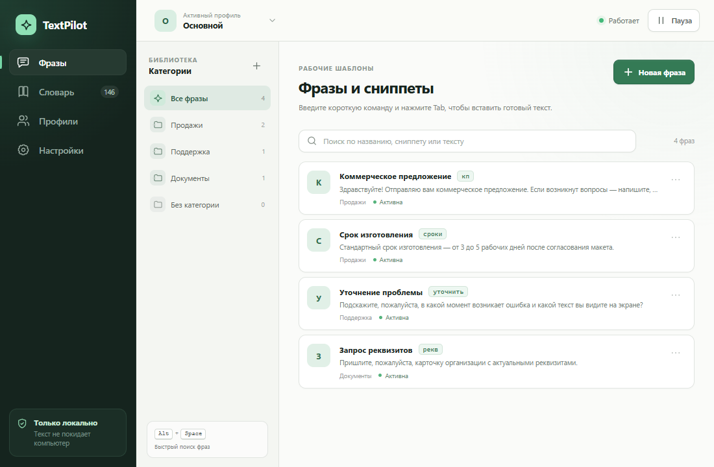
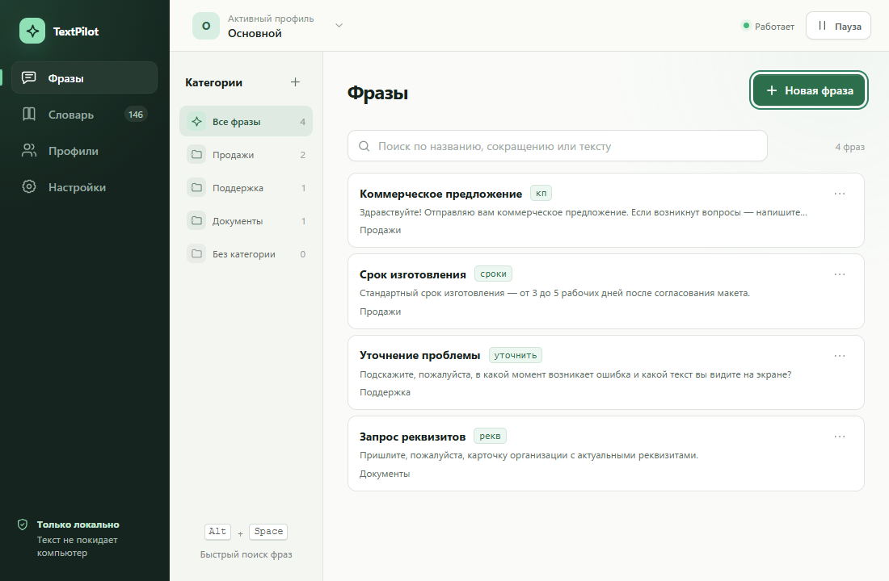

# UI/UX TextPilot: изменения и проверка

Реализован согласованный план без публикации релиза и изменения схемы базы данных.

## Что изменилось

- Единая типографика Segoe UI для основного окна, быстрого поиска и автодополнения; моноширинные сокращения — Consolas.
- Убраны повторяющиеся надзаголовки, буквенные плашки, обычные статусы «Активна» и декоративное движение карточек.
- Действия фраз и слов используют общее доступное меню; переключатели словаря выровнены и имеют `aria-pressed`.
- Формы защищают изменённый ввод, блокируют повторное сохранение, удерживают фокус и возвращают его после закрытия. Ошибки не очищают значения.
- При ширине менее 1200 px просмотр заменяет список. Возврат сохраняет фильтры и прокрутку.
- Резервирование собрано в одну группу. Истории профиля и всей базы раскрываются отдельно; область восстановления подписана.
- Стрелки в быстром поиске прокручивают выделение; ошибка вставки остаётся в окне поиска.
- Размер окна автодополнения учитывает внешние отступы, границы и padding списка.

## До и после

Снимки одной и той же демонстрационной библиотеки, 1100 × 720, Edge. Это изолированный браузерный стенд с подменой Tauri IPC, а не пользовательские данные.

| Экран | До | После |
|---|---|---|
| Фразы | [Снимок](before/phrases.png) | [Снимок](after/phrases.png) |
| Словарь | [Снимок](before/dictionary.png) | [Снимок](after/dictionary.png) |
| Профили | [Снимок](before/profiles.png) | [Снимок](after/profiles.png) |
| Настройки | [Снимок](before/settings.png) | [Снимок](after/settings.png) |

До:

После:

Дополнительные состояния: [защита ввода](after/unsaved-confirmation.png), [меню фразы](after/phrase-menu.png), [данные и резервные копии](after/data-settings.png), [редактор при 820 × 560](after/editor-820-1.png), [словарь при 1440 × 900](after/dictionary-1440-1.png), [ошибка вставки](after/quick-search-error.png), [автодополнение](after/autocomplete-1.png).

## Выполненные проверки

- `bun run check`: 0 ошибок и предупреждений Svelte/TypeScript.
- `bun run build`: успешная production-сборка.
- `cargo check --manifest-path src-tauri/Cargo.toml --offline`: успешно.
- `cargo build --manifest-path src-tauri/Cargo.toml --offline`: собран отладочный Tauri.
- `cargo test --manifest-path src-tauri/Cargo.toml --offline`: 40 тестов движка и хранилища, все прошли.
- `node scripts/ui-check.cjs`: 12 групп поведенческих проверок, без необработанных ошибок браузера. [Результат](after/checks.json).
- Основное окно: 820 × 560, 1100 × 720, 1440 × 900 при `deviceScaleFactor` 1, 1.25 и 1.5. Быстрый поиск: 520 × 380 и 680 × 500. Проверены длинные названия, вложенные категории, выключенные элементы, пустая выдача, границы панелей и прокрутка.

Нативная проверка выполнена в настоящем WebView2 через локальное отладочное подключение, на отдельной временной базе `TEXTPILOT_DATA_DIR`. Движок тестового экземпляра был приостановлен. Проверены через UI и реальные команды Tauri: создание фразы, включение/выключение, создание слова и переключение автодополнения, создание резервной копии и восстановление профиля. Быстрый поиск получил реальные результаты SQLite через событие Tauri.

Нативные снимки: [фразы](native/phrases.png), [просмотр](native/detail.png), [словарь](native/dictionary.png), [восстановление](native/restore-profile.png), [быстрый поиск](native/quick-search.png). [Результат нативной проверки](native/checks.json).

## Ограничения проверки

- `deviceScaleFactor` в браузере не заменяет изменение масштаба дисплея Windows. Нативный WebView2 проверен при текущем масштабе 100% и размере 1100 × 720; Windows 125/150% не переключался.
- Автоматическое изменение размера нативного окна через Tauri IPC недоступно без `core:window:allow-set-size`. Разрешения приложения ради тестов не расширялись; остальные размеры проверены браузерным стендом.
- Вставка текста в стороннее приложение, системный перехват Tab/Alt+Space и позиционирование подсказки возле настоящей каретки вручную не проверены. Существующие Rust-тесты обработки ввода прошли.
- Постоянные черновики и защита от закрытия всего приложения не входят в этот этап.

## Повторный запуск браузерного стенда

В первом терминале запустить `bun run dev`, во втором — `node scripts/ui-check.cjs`. Нужен установленный Microsoft Edge и доступный Node.js пакет `playwright` (локально либо через `NODE_PATH`). В текущей среде использован Playwright из комплекта инструментов Codex; зависимости приложения не менялись.

Можно задать `TEXTPILOT_UI_URL` для другого локального адреса и `TEXTPILOT_BROWSER` для другого установленного канала Chromium. Скрипт создаёт отдельные браузерные контексты с тестовыми данными, сохраняет снимки в `docs/ui-review/after` и не обращается к реальной базе приложения.
